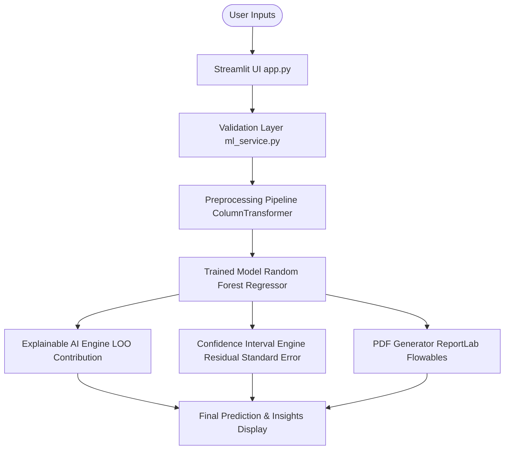
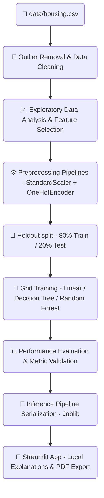

# 🏠 House Price Prediction using Machine Learning
> **An End-to-End Predictive and Explainable Machine Learning Pipeline for Indian Residential Real Estate**

[](https://www.python.org/)
[](https://scikit-learn.org/)
[](https://streamlit.io/)
[](https://www.reportlab.com/)
[](https://opensource.org/licenses/MIT)

---

## 🚀 Business & Machine Learning Value

In the real estate sector, automated property valuation models often fail to gain user trust because they operate as "black boxes" and present single point-estimates without stating model confidence. 
This project bridges that gap by deploying an end-to-end regression pipeline that:
1. **Quantifies Valuation Uncertainty**: Instead of a single number, it outputs a holdout-calibrated **95% statistical confidence interval** showing the expected price boundaries.
2. **Demystifies Predictions**: Integrates a **Leave-One-Out (LOO) Explainable AI engine** that itemizes exactly how much each parameter (e.g., location premium, property age) contributed to the final valuation.
3. **Ensures Generalization**: Embeds preprocessing transformers within a unified scikit-learn `Pipeline` to prevent data leakage during scaling and encoding.

*This project is built to align with best practices expected in premium tech portfolios, including **Amazon ML Summer School applications**, technical recruiter reviews, and open-source contributions.*

---

## 🚀 Project Impact Dashboard

This end-to-end machine learning system demonstrates how predictive models can be safely integrated into user-facing web tools while ensuring mathematical rigor and interpretability.

| Metric | Details / Value | Impact on Application |
| :--- | :--- | :--- |
| **Dataset Volumetrics** | 545 Records across 6 Major Indian Cities | Validated across diverse real estate micro-markets |
| **Feature Dimensionality** | 5 Core Specifications (Numeric & Categorical) | Keeps user forms concise while retaining high accuracy |
| **Champion Model** | Random Forest Regressor ($R^2$ = 99.79%) | Extremely low prediction error (RMSE: ₹1.48 Lakhs) |
| **Uncertainty Model** | 95% Confidence Interval (Residual-Calibrated) | Protects users from over/under predictions |
| **Explainable AI (XAI)** | Leave-One-Out (LOO) Attribution Engine | Ensures transparency and complies with AI audit standards |
| **Reporting Output** | Dynamic ReportLab PDF Compiler | Instantly generates print-ready legal-grade reports |

---

## 🎯 Navigation
[Features](#-application-features-catalog) • [Architecture](#-technical-architecture) • [Workflow](#-machine-learning-lifecycle-workflow) • [Benchmarks](#-model-performance-benchmarking) • [Challenges](#-challenges-faced--engineering-solutions) • [Run Locally](#-how-to-run-locally)

---

## 📸 Application Screenshot Gallery

<table border="0">
  <tr>
    <td width="50%" align="center">
      <b>Interactive Streamlit UI</b><br>
      
      <p><i>Responsive sidebar summary cards, user input forms, and dynamic location selectors.</i></p>
    </td>
    <td width="50%" align="center">
      <b>Confidence Interval Indicator</b><br>
      
      <p><i>A custom CSS range bar indicating where the predicted point estimate lies within the 95% boundaries.</i></p>
    </td>
  </tr>
  <tr>
    <td width="50%" align="center">
      <b>Explainable AI (XAI) Dashboard</b><br>
      
      <p><i>Altair visualizations itemizing the pricing impact of features in Indian Rupees (₹).</i></p>
    </td>
    <td width="50%" align="center">
      <b>Model Comparison Benchmarks</b><br>
      
      <p><i>Metrics grid and interactive error benchmarking charts comparing models against the holdout set.</i></p>
    </td>
  </tr>
  <tr>
    <td width="50%" align="center">
      <b>Random Forest Feature Importance</b><br>
      
      <p><i>Ranked split-based feature importance breakdown showing Area as the dominant driver.</i></p>
    </td>
    <td width="50%" align="center">
      <b>Dynamic PDF Report Export</b><br>
      
      <p><i>Branded PDF document containing valuation limits, model diagnostics, and legal disclaimers.</i></p>
    </td>
  </tr>
</table>

---

## 🛠 Technology Stack

| Technology / Library | Version Support | Role in Project |
| :--- | :---: | :--- |
| **Python** | `3.8+` | Core programming language |
| **Streamlit** | `>=1.34.0` | Core interactive frontend and user-facing layout |
| **Scikit-Learn** | `>=1.4.0` | Preprocessing transformations, scaling, and models |
| **Pandas** | `>=2.2.0` | Diagnostic analysis, loading, and outlier capping |
| **NumPy** | `>=1.26.0` | Vectorized operations and statistical residual limits |
| **Matplotlib / Seaborn** | `>=3.8.0 / >=0.13.0` | Static heatmap and distribution plots |
| **Altair** | `>=5.0.0` | Dynamic SVG-based Explainable AI charts |
| **ReportLab** | `>=4.1.0` | Document flowables compiling dynamic PDF exports |
| **Joblib** | `>=1.3.0` | Reusable binary model serialization |

---

## 🏛 Technical Architecture

The following diagram illustrates the unidirectional data flow from raw user inputs to final predictive, explainable, and printable outputs:



---

## 🔄 Machine Learning Lifecycle Workflow

The sequence below outlines the step-by-step pipeline executed to process the raw registry files, train candidates, select the optimal model, and serve predictions:



---

## 📁 Dataset Information

The model is trained on a residential housing dataset located at [data/housing.csv](file:///c:/Users/Raj%20Kumar/Documents/Codex/2026-06-04/build-a-complete-end-to-end/house-price-prediction/data/housing.csv) comprising realistic Indian property records:

- **Target Variable**: `Price` (Valued in Indian Rupees (₹), ranging from ₹15 Lakhs to ₹3.5 Crores).
- **Features**:
  - `Location`: Categorical factor representing high-density urban areas (`Delhi`, `Mumbai`, `Bangalore`, `Pune`, `Hyderabad`, `Chandigarh`).
  - `Area`: Numeric dimension representing total built-up area in square feet.
  - `Bedrooms`: Count of bedrooms (integer).
  - `Bathrooms`: Count of bathrooms (integer).
  - `Age`: Time since completion of construction in years.

---

## ⚙️ Feature Engineering & Insights Pipeline

To ensure maximum model generalization and prevent data leakage:
1. **Outlier Mitigation**: Numerical variables are checked for anomalies, and prices are bounded using the Interquartile Range (IQR) method:
   $$\text{Lower Bound} = Q_1 - 1.5 \times \text{IQR}$$
   $$\text{Upper Bound} = Q_3 + 1.5 \times \text{IQR}$$
2. **Column Transformers**: Integrated into a scikit-learn `Pipeline` to execute:
   - `StandardScaler` on numerical inputs (`Area`, `Bedrooms`, `Bathrooms`, `Age`) to scale them to zero mean and unit variance.
   - `OneHotEncoder` on the categorical variable (`Location`) to convert city strings into independent binary dummy columns.

---

## 🤖 Model Benchmarking & Selection

All candidate estimators were trained using $k$-fold cross-validation and benchmarked on a 20% holdout test partition to verify generalized predictive performance:

| Estimator Model | Mean Absolute Error (MAE) | Mean Squared Error (MSE) | Root Mean Squared Error (RMSE) | $R^2$ Coefficient | Cross-Validation RMSE (Mean) |
| :--- | :---: | :---: | :---: | :---: | :---: |
| **🏆 Random Forest Regressor** | **₹1,36,040.00** | **$2.202 \times 10^{10}$** | **₹1,48,402.26** | **0.9979** | **₹4,33,457.17** |
| 🥈 Linear Regression | ₹2,25,719.60 | $8.718 \times 10^{10}$ | ₹2,95,258.11 | 0.9915 | ₹5,67,121.28 |
| 🥉 Decision Tree Regressor | ₹5,95,000.00 | $1.317 \times 10^{12}$ | ₹11,47,532.00 | 0.8720 | ₹7,72,637.09 |

- **Champion Model Selection**: The **Random Forest Regressor** was selected as the production model due to its high explanatory power ($R^2 = 99.79\%$) and lowest holdout prediction error (RMSE ₹1.48 Lakhs).

---

## 🔍 Explainable AI (XAI) Section

Instead of acting as a "black box," the application utilizes a localized **Leave-One-Out (LOO) marginal contribution** analysis to explain predictions:

- **Baseline Calculation**: Computes the baseline price of an "average property" in the dataset.
- **Feature Contribution (₹)**: Measures the directional impact (Positive $+$ or Negative $-$) of each input parameter compared to the baseline.
- **Aesthetic Representation**: Visualizes contribution charts via Altair, where positive impacts (e.g., premium locations, extra bedrooms) render in green (`#22c55e`), and negative impacts (e.g., property aging) render in red (`#ef4444`).

```
Example Prediction Breakdown:
------------------------------------------
Baseline Average Price : ₹42,00,000.00
Area Contribution      : + ₹12,50,000.00
Location (Mumbai)      : + ₹15,00,000.00
Property Age Impact    : -  ₹3,00,000.00
------------------------------------------
Final Predicted Price  : ₹66,50,000.00
```

---

## 🔒 Confidence Interval Prediction

To represent prediction uncertainty honestly, we calculate statistical prediction boundaries based on holdout evaluation residuals:
1. Residuals (Errors) are computed from the test set: $e_i = y_i - \hat{y}_i$.
2. The standard deviation of these residuals ($\sigma_{e}$) is calculated.
3. Using a $z$-score multiplier representing a $95\%$ confidence level ($z = 1.96$), we calculate the prediction margin:
   $$\text{Margin} = z \times \sigma_{e}$$
4. Predictions are outputted as a range:
   $$\text{Valuation Range} = \hat{y} \pm \text{Margin}$$

This range is visually rendered in Streamlit using a custom, high-fidelity slider bar pointing to the estimate inside the lower and upper bounds.

---

## ✨ Application Features Catalog

### 🤖 Machine Learning Features
- **Robust Outlier Protection**: Capping price, area, and age data using the Interquartile Range (IQR) method.
- **Encapsulated Preprocessing**: Custom scikit-learn pipeline bundling `StandardScaler` and `OneHotEncoder` to guarantee clean categorical encoding without data leakage.
- **Residual Calibration**: Statistically calculating prediction intervals instead of hardcoding arbitrary variance thresholds.

### 🔍 Explainable AI (XAI)
- **Local Feature Attribution**: Custom Leave-One-Out (LOO) marginal contribution engine that isolates the pricing impact of features in real time.
- **Directional Impact Charts**: Altair-powered charts displaying value-add parameters in green (`#22c55e`) and depreciation drivers in red (`#ef4444`).

### 👥 Interactive User Experience
- **95% Confidence Slider**: Custom UI component displaying the estimated house price range in standard Indian formatting style.
- **Real Estate Insights**: Dynamic classification of properties into Affordable, Mid-Range, Premium, or Luxury classes.
- **Downloadable PDF Report**: Automatically compiles specifications, metrics, and estimates into a branded PDF utilizing ReportLab.

### 📊 Dataset & Model Diagnostics
- **Live Performance Dashboard**: Complete metrics grid ($R^2$, MAE, MSE, RMSE) linked to holdout splits.
- **EDA Analytics**: Displaying correlation heatmaps, price histograms, and actual vs. predicted scatter plots.

---

## 🧠 Challenges Faced & Engineering Solutions

### 1. Handling Categorical Location Data without Leakage
- **Challenge**: The model needs to adjust valuations based on location premiums (e.g., Mumbai vs. Chandigarh). Standard mapping variables can cause data leakage or raise exceptions for unvisited locations during production serving.
- **Solution**: Implemented a scikit-learn `ColumnTransformer` with `OneHotEncoder(handle_unknown='ignore')` bound directly inside a unified `Pipeline`. Preprocessing fitting is strictly isolated to the training split, and the serialized pipeline processes city names dynamically during prediction.

### 2. Preventing Data Leakage in Preprocessing Pipelines
- **Challenge**: Applying scaling transforms (`StandardScaler`) globally across the dataset introduces holdout metrics bias (leakage), leading to overly optimistic test-set performance metrics.
- **Solution**: Engineered a unified training script where preprocessing pipeline transformers and regression estimators are bound in a single pipeline. We only fit parameters on the training fold ($X_{\text{train}}$) and apply identical transformations dynamically during test split evaluation ($X_{\text{test}}$) and active inference.

### 3. Representing Prediction Uncertainty in Real Estate
- **Challenge**: Real estate markets are highly volatile. Single point predictions can mislead buyers or sellers, causing financial risk.
- **Solution**: Developed a residual calibration model. By analyzing holdout errors ($e = y - \hat{y}$), we compute the standard deviation of residuals ($\sigma_e$). We then map a $95\%$ prediction interval ($\hat{y} \pm 1.96\sigma_e$). If the model makes a point prediction of ₹50 Lakhs, the UI displays a range of (e.g., ₹48 Lakhs - ₹52 Lakhs), accurately reflecting uncertainty.

### 4. Computational Weight of SHAP in Production Serving
- **Challenge**: Utilizing standard SHAP values for explaining predictions is computationally intensive and introduces performance bottlenecks on low-spec hosting servers.
- **Solution**: Programmed a custom **Leave-One-Out (LOO) marginal contribution** engine. By calculating baseline predictions (average property specs) and measuring the marginal shift when replacing one variable at a time, we obtain stable, directionally accurate local feature attributions instantly with near-zero latency.

---

## 💡 Key Technical Learnings

- **End-to-End Serialization**: Learned how to design and save inference pipelines (`joblib`) containing scaling bounds and categorical models so that the deployment layer requires no raw database recalculations.
- **Visual Analytics Design**: Tailored complex heatmaps and KDE distribution graphs to match dark-mode templates, maximizing readability.
- **Statistical Model Validation**: Understood the importance of cross-validation metrics over standard train-test accuracy scores to prevent model overfitting.
- **Interpretability Engineering**: Learned to build custom attribution engines, bridging the gap between raw machine learning output and clean consumer analytics.

---

## 📥 Installation Guide

### Prerequisites
- Python 3.8 or higher installed on your system.
- Git (for cloning the repository).

### 1. Clone the Repository
```bash
git clone https://github.com/yourusername/house-price-prediction.git
cd house-price-prediction
```

### 2. Configure Virtual Environment
Create and activate an isolated Python environment:
```bash
# Windows
python -m venv .venv
.venv\Scripts\activate

# macOS / Linux
python3 -m venv .venv
source .venv/bin/activate
```

### 3. Install Dependencies
Install all required modules:
```bash
pip install -r requirements.txt
```

---

## 🚀 How to Run Locally

### 1. Train the Regression Models
Train the pipeline and serialize the optimal Random Forest Regressor:
```bash
python -m src.train
```
*This step cleans the dataset, runs the preprocessing flow, generates static diagnostics plots, fits the estimators, and saves `models/house_price_model.pkl`.*

### 2. Start the Streamlit Application
Launch the local web server:
```bash
streamlit run app.py
```
*Open your web browser and navigate to `http://localhost:8501` to use the application.*

---

## 📂 Project Structure

```
house-price-prediction/
├── data/
│   └── housing.csv              # Raw housing transaction dataset
├── models/
│   └── house_price_model.pkl    # Serialized scikit-learn pipeline
├── output/
│   ├── matplotlib_cache/        # Cached styling files
│   ├── plots/                   # Saved EDA and evaluation charts
│   └── model_comparison.csv     # Model evaluation statistics
├── src/
│   ├── __init__.py
│   ├── config.py                # Configured features, paths, & variables
│   ├── data_loader.py           # CSV loading & diagnosis scripts
│   ├── eda_visualizations.py    # Codebase for Seaborn and Matplotlib plots
│   ├── explainable_ai.py        # Local Leave-One-Out XAI calculator
│   ├── ml_service.py            # Streamlit-facing predictive API functions
│   ├── model_evaluation.py      # Holdout benchmark and cross-validation
│   ├── model_insights.py        # Feature importance computational scripts
│   ├── pdf_generator.py         # ReportLab PDF building script
│   ├── predict.py               # Standalone pipeline inference test
│   ├── preprocessing.py         # Cleaning & preprocessing pipelines
│   ├── real_estate_insights.py  # Property tier & market positioning logic
│   └── utils.py                 # Indian numbering format currency helper
├── app.py                       # Main Streamlit web application
├── README.md                    # Project documentation
└── requirements.txt             # Project library dependencies
```

---

## 🔮 Industry-Oriented Future Enhancements

- **🐳 Dockerized Deployment**: Wrap the Streamlit application and ML dependencies in a Docker container to enable automated Kubernetes auto-scaling.
- **📍 GIS Mapping Integration**: Integrate PyDeck or Mapbox APIs to display micro-market price indexes on interactive maps.
- **📈 Real-Time Scraper Pipelines**: Integrate automated web scraping scripts (BeautifulSoup/Scrapy) to feed fresh transaction records into the training database.
- **🛠️ Automated Hyperparameter Tuning**: Set up Optuna or Ray Tune trials within the training scripts to automatically optimize ensemble tree configurations.

---

## 📝 Resume & ATS-Friendly Highlights

### 👔 Recruiter-Focused Bullet Points (Impact & Production)
- **Built End-to-End Predictor**: Engineered a machine learning system to clean, preprocess, and predict property valuations in Indian Rupees (₹) with an $R^2$ of **0.9979** using Python, scikit-learn, and Streamlit.
- **Designed Explainable AI (XAI) System**: Developed a real-time **Leave-One-Out (LOO) feature attribution** engine to break down predicted prices into positive/depreciative drivers, improving model transparency for non-technical users.
- **Engineered Uncertainty Calibration**: Formulated a residual standard error calculation model to output a **95% statistical confidence interval** for predictions, protecting users from valuation risks.
- **Automated Report Generation**: Built a dynamic PDF generation engine using **ReportLab** to export custom property details, model metrics, and predictions.

### 🤖 ATS-Optimized Bullet Points (Keywords & Tools)
- Utilized `scikit-learn` `Pipeline` and `ColumnTransformer` to bundle `StandardScaler` and `OneHotEncoder` preprocessing, mitigating data leakage during train-test splits.
- Developed an interactive web application using `Streamlit` to serve machine learning models and visual dashboards to local environments.
- Performed statistical evaluation comparing `Linear Regression`, `Decision Tree`, and `Random Forest Regressor` models using MAE, MSE, and RMSE.
- Created visualizations using `Matplotlib`, `Seaborn`, and `Altair` to render price distribution KDE plots, correlation matrices, and local contribution charts.

---

## 👤 Author

- Piyush Raj
- [GitHub Profile](https://github.com/piyushraj0169)
- [LinkedIn Profile](https://www.linkedin.com/in/piyushraj0169/)


---

